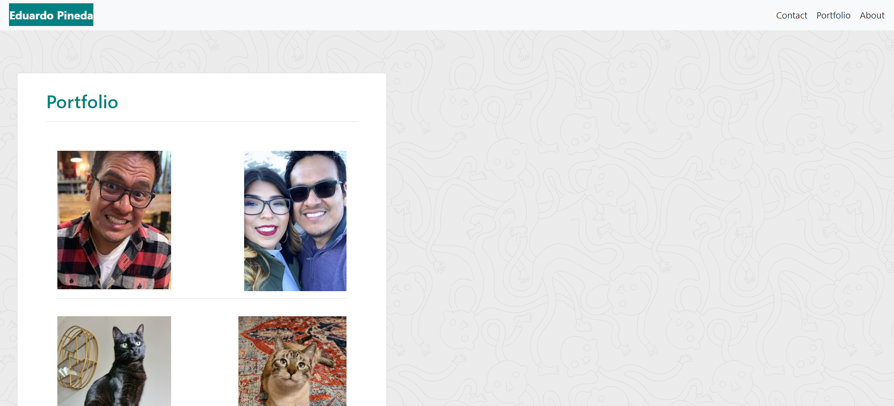

# My Responsive Portfolio

## Description

With this portfolio, I made it a mission for future employers and peers to get a small glimpse of who I am.
I'm just one of over 60 students currently Georgia Tech's Full Time Coding Boot Camp, and I can assure that we are up to our heads with this curriculum, but at the end of the day, we are all people, and with this project, it allowed us to showcase what we have learned so far by allowing us to create a site that showcased our current skills, but also let us ecpress ourselves with the fun pictures we posted and also the information we shared.

This project let us show what we have learned so far during this course, which at the time has only been a week and a half. It's a good measuring stick of where we currently are and it will be fun to come back at the end of the course to show us how far we have come.

## Contents

The following links provided are for my personal GitHub, which will show all my files associated with this work, including this README, and 4 HTML files, and also a CSS file. They will show my process while completing this task by showing all the times i made minor and major changes by Git Push. The second link is of the functioning page itself. It's 3 pages in all, each being linked to each other by cliking on the links. The fourth page is just a "Thank You" to the viewer by clicking on my interactive "submit" button. These pages and files show the hard work I have put in as a Coder who is just beggining, but also scratching the surface. 

## Contact Me

If contact would like to be made with me, the author, for suggestions or critiques, they can be left on:

*my personal e-mail

*my personal GitHub account

*my LinkedIn

## Credits

Credit to GetBootStrap page for showing us templates and letting us to use their codes for our work.

## License

MIT License

Copyright (c) [2020] [Eduardo Pineda]

Permission is hereby granted, free of charge, to any person obtaining a copy
of this software and associated documentation files (the "Software"), to deal
in the Software without restriction, including without limitation the rights
to use, copy, modify, merge, publish, distribute, sublicense, and/or sell
copies of the Software, and to permit persons to whom the Software is
furnished to do so, subject to the following conditions:

The above copyright notice and this permission notice shall be included in all
copies or substantial portions of the Software.

THE SOFTWARE IS PROVIDED "AS IS", WITHOUT WARRANTY OF ANY KIND, EXPRESS OR
IMPLIED, INCLUDING BUT NOT LIMITED TO THE WARRANTIES OF MERCHANTABILITY,
FITNESS FOR A PARTICULAR PURPOSE AND NONINFRINGEMENT. IN NO EVENT SHALL THE
AUTHORS OR COPYRIGHT HOLDERS BE LIABLE FOR ANY CLAIM, DAMAGES OR OTHER
LIABILITY, WHETHER IN AN ACTION OF CONTRACT, TORT OR OTHERWISE, ARISING FROM,
OUT OF OR IN CONNECTION WITH THE SOFTWARE OR THE USE OR OTHER DEALINGS IN THE
SOFTWARE.